# 🔧 API Dummy + JMeter Performance Testing

<div align="center">

[](https://nodejs.org/)
[](https://docs.docker.com/compose/)
[](https://jmeter.apache.org/)

[](https://github.com/gperzal/jmeter-tests/actions/workflows/jmeter-test.yml)

</div>

---

## 📋 Description

**API Dummy + JMeter** is a minimalistic Node.js application and testing setup designed to simulate a basic REST API and validate its performance using Apache JMeter, integrated with GitHub Actions.

🎯 **Main Objective:**  
To simulate realistic performance tests under concurrent load using JMeter, while validating the API's stability and response metrics through CI/CD.

---

## 🛠️ Tech Stack

| Tool              | Purpose                                     |
| ----------------- | ------------------------------------------- |
| ⚙️ Node.js        | API dummy server with Express               |
| 🐳 Docker         | Containerized app and test runner           |
| 🧪 JMeter         | Load and performance testing tool           |
| 🔄 GitHub Actions | CI pipeline to automate performance testing |

---

## 🧩 Project Structure

```
project-root/
│
├── 📁 app-dummy/
│   ├── Dockerfile                   # Docker image for API
│   ├── docker-compose.yml          # Compose config to run the API
│   ├── package.json                # Express config and start script
│   └── server.js                  # Defines /api/ping and /api/echo
│
├── 📁 jmeter/
│   ├── test-plan.jmx              # JMeter test plan (Thread Group, Samplers)
│   ├── resultados.jtl             # Raw test results
│   └── report/                    # HTML report generated (gitignored)
│
└── 📁 .github/workflows/
    └── main.yml                   # CI Workflow for Docker + JMeter
```

---

## 🧪 How to Run Performance Tests

### 🖥️ Locally with Docker & JMeter

```bash
# 1. Start the dummy API
cd app-dummy
docker compose up --build -d

# 2. In a separate terminal, run the JMeter test via npm
npm run jmeter

# 3. View HTML report:
start jmeter/report/index.html   # Windows
open jmeter/report/index.html    # macOS
xdg-open jmeter/report/index.html # Linux
```

### 🔁 Via GitHub Actions

Each push to `main` or PR triggers a CI job that:

- Builds and runs the Docker-based API
- Waits until `/api/ping` responds
- Executes JMeter test inside container
- Uploads the HTML performance report as an artifact (retention: 30 days)

---

## 🔄 GitHub Actions Workflow (CI)

```mermaid
graph TD
  A[📦 Push or PR] --> B[📥 Checkout repository]
  B --> C[🐳 Docker Compose up]
  C --> D[⏳ Wait for /api/ping]
  D --> E[🧪 Run JMeter test]
  E --> F[📈 Upload HTML report]

```



✅ You can find this logic in `.github/workflows/main.yml`

---

## ⚠️ Important Note: Docker Compose, Paths, Hostnames & Test Execution Strategy

> 🔥 **Avoid common pitfalls when combining JMeter, Docker Compose, and GitHub Actions**

### ✅ 1. Use correct file paths

If your `docker-compose.yml` is inside a subdirectory (like `app-dummy/`), and your JMeter files live in a root-level `jmeter/` folder, you must mount the correct volume path:

```yaml
volumes:
  - ../jmeter:/tests
```

And in your GitHub Actions workflow, make sure the job runs from the correct folder:

```yaml
working-directory: app-dummy
```

📁 This ensures JMeter will correctly find the test plan file at:

```
/tests/test-plan.jmx
```

❌ **If you omit the `../`, the container won't find your test plan and will fail with**:  
`The file /tests/test-plan.jmx doesn't exist or can't be opened`


---

### ✅ 2. Reference Docker service names in your test plan

JMeter must target the container's **service name**, not `localhost`. In `test-plan.jmx`, update:

```xml
<stringProp name="HTTPSampler.domain">app</stringProp>
```

This tells JMeter to route traffic internally through Docker's virtual network to the `app` service.

---

### ✅ 3. Moved test execution **from GitHub Actions to Docker Compose**

Originally, the workflow ran the API (`npm start`) via Docker Compose, waited for it to be ready with `curl`, and then executed JMeter via a separate `docker run` command:

```yaml
- name: Wait for the API to be ready
- name: Run JMeter test with justb4/jmeter
```

❌ This approach caused **network isolation issues** — `docker run` couldn't see the network created by `docker compose`.

---

### ✅ The solution: Run both `app` and `jmeter` as services within `docker-compose.yml`

This ensures:
- Both containers share the same internal Docker network.
- You don't need manual waits (`curl` loops).
- Test execution becomes portable (works locally + in CI with the same config).
- The test runs **automatically** when you execute:

```bash
docker compose up --abort-on-container-exit
```


## 📦 Best Practices Followed

| ✅  | Principle          | Implementation                            |
| --- | ------------------ | ----------------------------------------- |
| ✅  | Clean repo         | `node_modules`, `report/`, `.jtl` ignored |
| ✅  | Automation ready   | Fully Dockerized setup                    |
| ✅  | Reproducibility    | CI runs test from fresh environment       |
| ✅  | Artifact retention | Report stored for 30 days only            |

---

## 📜 License

```
This project is for educational and training purposes only.
Part of Agile Testing & Performance Module.
```

---

## 🙌 Credits

> Developed by students of DevOps/Testing module.  
> Powered by Node.js, Docker, and Apache JMeter.

---

<div align="center">

🚀 **Built to learn how to test APIs under load using modern DevOps workflows.**

</div>
